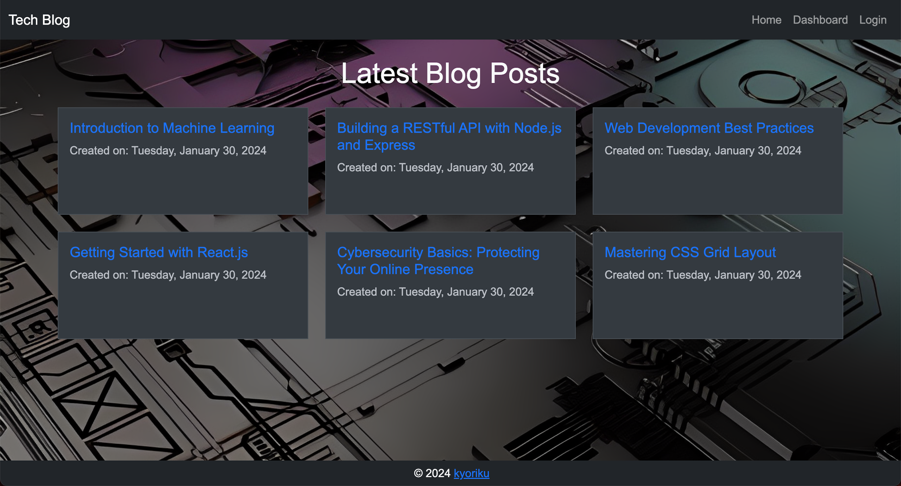

# Tech Blog CMS

[](https://opensource.org/licenses/MIT)

## Description
Tech Blog CMS is a content management system designed for developers to publish articles, blog posts, and share their thoughts and opinions on various technical concepts. Following the MVC paradigm, this application is built from scratch, utilizing [Handlebars.js](https://handlebarsjs.com/) as the templating language, [Sequelize](https://sequelize.org/) as the ORM, and the [express-session](https://www.npmjs.com/package/express-session) npm package for authentication. Whether you're a seasoned developer or just starting, this CMS-style blog site provides a platform for sharing and learning.

## Table of Contents
- [Installation](#installation)
- [Usage](#usage)
- [Deployment](#deployment)
- [License](#license)
- [Contributing](#contributing)
- [Questions](#questions)

## Installation
1. Clone the repository to your local machine.
    ```bash
    git clone https://github.com/kyoriku/tech-blog.git
    ```
2. Navigate to the project directory.
    ```bash
    cd tech-blog
    ```
3. Install the required dependencies.
    ```bash
    npm install
    ```

## Usage
1. Create a `.env` file with the following variables and fill in your database credentials
    ``` bash
    DB_NAME='your_database_name'
    DB_USER='your_MySQL_username'
    DB_PASSWORD='your_MySQL_password'
    SESSION_SECRET='your_session_secret'
    ```
2. Create the database with [MySQL Workbench](https://www.mysql.com/products/workbench/) or [MySQL Shell](https://dev.mysql.com/doc/mysql-shell/8.0/en/mysql-shell-getting-started.html) using the `schema.sql` file. 
    ``` bash
    DROP DATABASE IF EXISTS tech_blog_db;
    CREATE DATABASE tech_blog_db;
    ```
3. (Optional) Seed the database. To start with some initial data, you can run the following command:
    ``` bash
    npm run seed
    ```
4. Start the server.
    ``` bash
    npm start
    ```
5. Navigate to the [homepage](http://localhost:3001/) and start publishing and exploring blog posts.

### Demo Video

### Screenshots
- Homepage:


## Deployment
The Tech Blog CMS is deployed on Heroku. You can access the live application [here]().

## License
This application is covered by the [MIT](https://opensource.org/licenses/MIT) license.

## Contributing
If you want to contribute to this project, follow these steps:

1. Fork the repository.
2. Create a new branch for your feature or bug fix.
3. Make your changes and commit them with descriptive commit messages.
4. Push your changes to your branch.
5. Submit a pull request, explaining your changes.

## Questions
If you have any questions, please contact [kyoriku](https://github.com/kyoriku) or email devkyoriku@gmail.com.