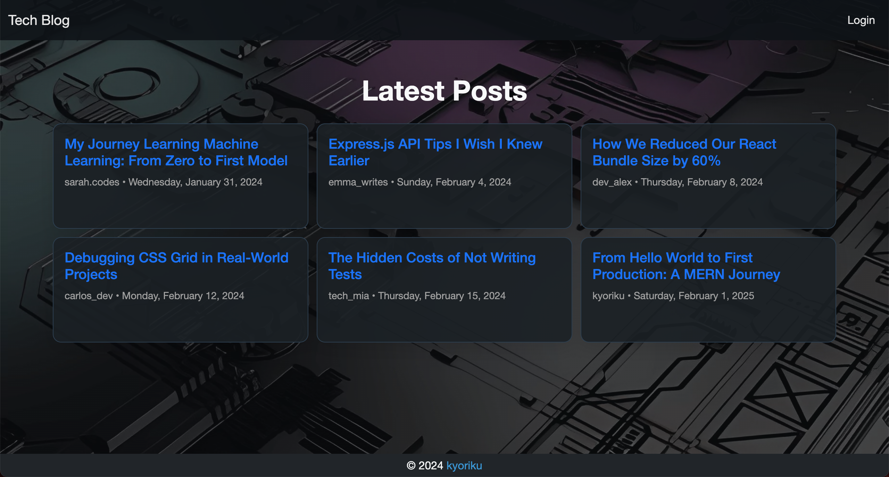
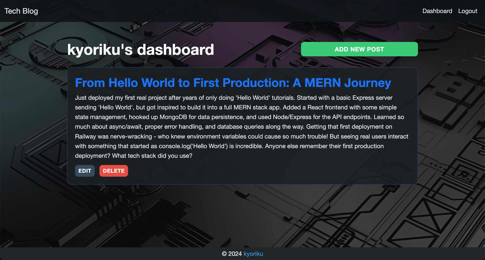

# MVC Tech Blog
*A full-stack blog application built with MVC architecture, featuring user authentication, commenting system, and post management capabilities*

## Built With
[](https://developer.mozilla.org/en-US/docs/Web/CSS)
[](https://developer.mozilla.org/en-US/docs/Web/JavaScript)
[](https://nodejs.org/en)
[](https://expressjs.com/)
[](https://www.mysql.com/)
[](https://sequelize.org/)
[](https://handlebarsjs.com/)
[](https://getbootstrap.com/)

## Table of Contents
- [Description](#description)
  - [Deployed Site](#deployed-site)
- [Features](#features)
- [Screenshots](#screenshots)
- [Technical Details](#technical-details)
- [Installation](#installation)
- [Usage](#usage)
- [Contributing](#contributing)
- [License](#license)
- [Questions](#questions)

## Description
This MVC Tech Blog is a full-stack web application designed for developers to share and discuss technical insights, challenges, and solutions. Built using the Model-View-Controller architectural pattern, this platform demonstrates the effective implementation of separation of concerns while providing a robust environment for technical discourse.

The application combines secure user authentication with intuitive blog management features, creating a professional space where developers can publish posts and engage in discussions through comments. The seamless integration of Express.js backend with Handlebars.js frontend templating ensures a smooth user experience while maintaining clean code organization through the MVC pattern.

### Deployed Site
Visit the live website at: [https://techblogcms-1e5c1470e624.herokuapp.com/](https://techblogcms-1e5c1470e624.herokuapp.com/)

## Features
* **User Authentication**
  * Secure user registration and login
  * Password encryption with bcrypt
  * Session management for logged-in users
  * Protected routes requiring authentication
  * Automatic session timeout handling

* **Blog Management**
  * Create and publish blog posts
  * Edit existing posts through dashboard
  * Delete unwanted posts
  * View post history and details
  * Real-time content updates

* **Comments System**
  * Comment on any blog post
  * View comments with author attribution
  * Timestamp tracking for all comments
  * Delete comment functionality
  * Login requirement for commenting

* **User Interface**
  * Responsive Bootstrap-based design
  * Intuitive navigation system
  * Dashboard for post management
  * Clean and professional layout
  * Mobile-friendly interface

## Screenshots




## Technical Details
This blog platform was built using the following technologies and patterns:

* **MVC Architecture**: Structured separation of concerns:
   * Models: Sequelize models for User, Post, Comment
   * Views: Handlebars.js templates for dynamic rendering
   * Controllers: Express.js route handlers in separate files
   * Clear data flow between components
   * RESTful API design

* **Database Design**: MySQL with Sequelize ORM:
   * User Model: Username, email, and secured password management
   * Post Model: Title and content with user relationship
   * Comment Model: Text content with user and post relationships
   * One-to-Many relationships (User->Posts, Posts->Comments)
   * Timestamp tracking for posts and comments

* **Authentication System**: Session-based user authentication:
   * Express-session for session management
   * Bcrypt for password hashing
   * Protected routes using middleware
   * Login/logout functionality
   * Session persistence

* **Route Structure**: Organized routing system:
   * Home routes for public access
   * Dashboard routes for authenticated users
   * API routes for data operations
   * Authentication middleware
   * Error handling middleware

* **Frontend Integration**: Dynamic templating system:
   * Handlebars.js layouts and partials
   * Responsive Bootstrap styling
   * Form handling and validation
   * Dynamic content rendering
   * Client-side JavaScript for interactions

* **Security Features**: Comprehensive security measures:
   * Password hashing
   * Session management
   * Protected routes
   * Data validation
   * SQL injection prevention through Sequelize

## Installation
To run this project locally:

1. Clone the repository
    ```bash
    git clone https://github.com/kyoriku/tech-blog-cms.git
    ```

2. Navigate to the project directory
    ```bash
    cd tech-blog-cms
    ```

3. Install dependencies
    ```bash
    npm install
    ```

4. Create a `.env` file with the following variables
    ```bash
    DB_NAME='tech_blog_db'
    DB_USER='your_MySQL_username'
    DB_PASSWORD='your_MySQL_password'
    SESSION_SECRET='your_session_secret'
    ```

5. Set up the database
    ```bash
    mysql -u root -p
    source db/schema.sql
    ```

6. (Optional) Seed the database
    ```bash
    npm run seed
    ```

## Usage
1. Start the server
    ```bash
    npm start
    ```

2. Access the application at `http://localhost:3001`

3. Create an account to:
   * Create, edit, and delete blog posts
   * Comment on posts
   * Manage your content through the dashboard
   * View your post history

## Contributing
Contributions are welcome! Here are ways you can help:

1. Fork the repository
2. Create a feature branch
    ```bash
    git checkout -b feature/YourFeature
    ```
3. Make your changes - this could include:
    * Adding new features
    * Improving the UI/UX
    * Optimizing database queries
    * Enhancing security
    * Bug fixes
4. Commit your changes
5. Push to your branch
6. Open a Pull Request

Please ensure your contributions:
* Follow the existing code style
* Include appropriate error handling
* Test all changes locally
* Include clear descriptions in your pull request

## License
[](https://opensource.org/licenses/MIT)

This project is licensed under the [MIT](https://opensource.org/licenses/MIT) license - see the LICENSE file for details.

## Questions
For any questions, feel free to email me at devkyoriku@gmail.com.